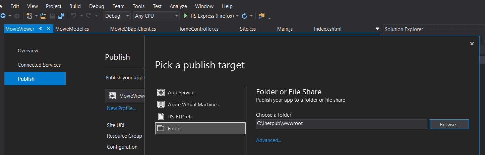

# MoviesViewer

This is a simple Web Application, that displays popular movies from [The Movie Database](https://www.themoviedb.org/)

Application built using ASP.NET (.NET 4.6.1) Server Side and Javascript on Front End.

**Installation Instructions ( IDE: MS Visual Studio 2017 or 2019):**

1.Add the solution to VS Studio (MovieViewer.sln)

2.Build the Solution (Ctrl+Shift+B or using the Build button found on VS tasks bar)

3.Publish App on preferred methods and targets  (see image below)

